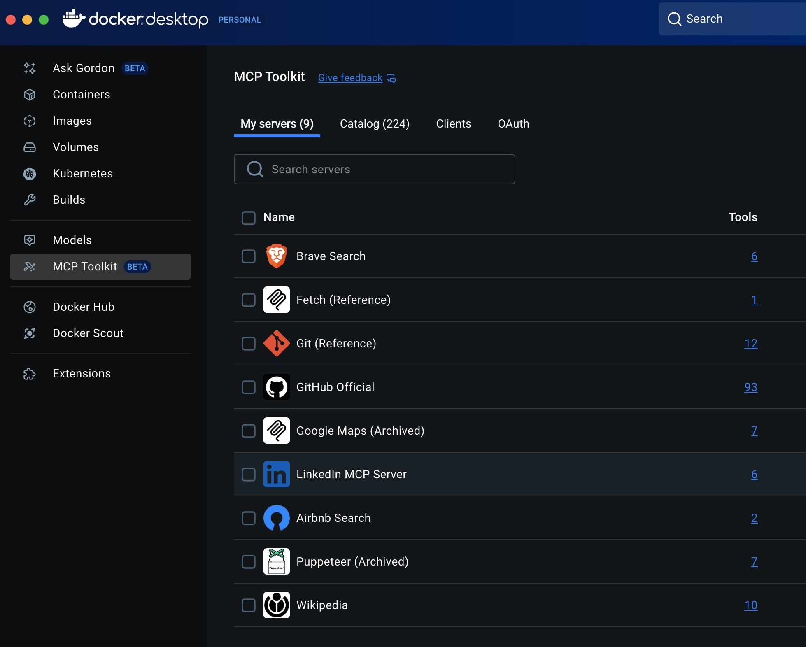

&nbsp;&nbsp;&nbsp;&nbsp;

&nbsp;&nbsp;&nbsp;&nbsp;

# Meeting Prep Agent

Reimplementation
of [Crew AI](https://www.crewai.com/)'
s [Prep for a Meeting Agent](https://github.com/crewAIInc/crewAI-examples/tree/main/crews/prep-for-a-meeting)
in Embabel.

Shows:

- A [domain](src/main/java/com/embabel/prepper/agent/Domain.java) model, ensuring that LLM calls are type safe and
  offering extensibility

# Configuration

You will need an `OPENAI_API_KEY` environment variable set to your OpenAI API key.

Alternatively you can change the starters in [the Maven pom](pom.xml) to use
another Embabel model provider, such as Anthropic.
> You can also use local LLMs with Ollama.

This project relies on MCP tools. You will need Docker Desktop, with
the [Docker MCP gateway](https://docs.docker.com/ai/mcp-gateway/) running, with Brave
web search, wikipedia, and LinkedIn tools enabled. Your configuration
should look like this:



# Running

Run the shell script to start Embabel under Spring Shell:

```bash
./scripts/shell.sh
```

Run the `prep` command.
