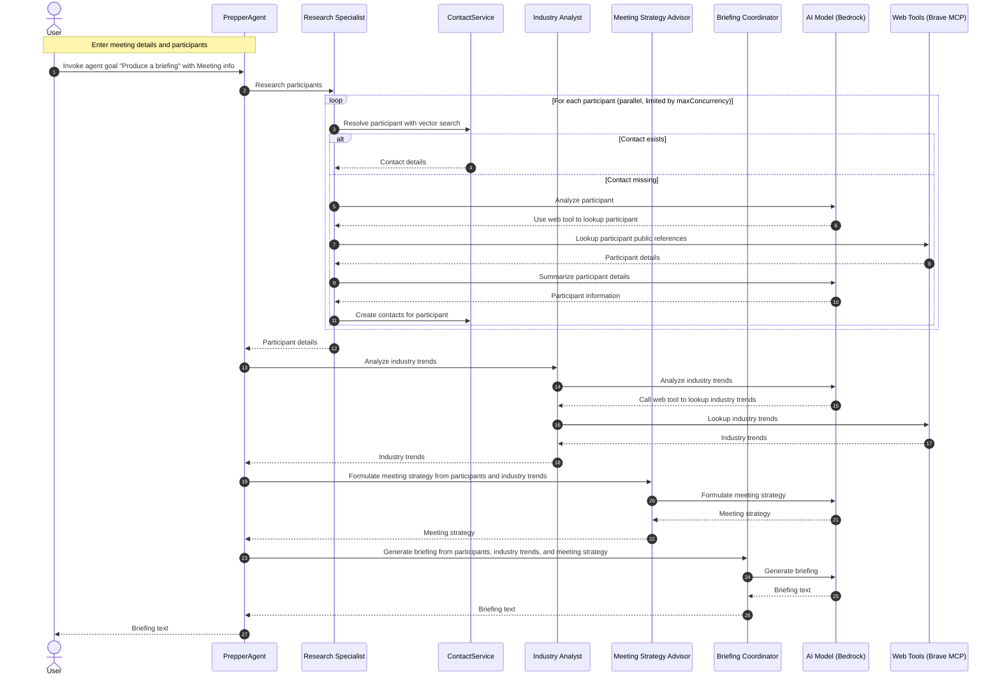

## Prepper

Embabel sample application for meeting preperation.


```mermaid
sequenceDiagram
  autonumber
  actor User
  participant Agent as PrepperAgent
  participant Researcher as Research Specialist
  participant CS as ContactService
  participant IndustryAnalyzer as Industry Analyst
  participant MeetingStrategist as Meeting Strategy Advisor
  participant BriefingWriter as Briefing Coordinator
  participant AI as AI Model (Bedrock)
  participant Web as Web Tools (Brave MCP)

  Note over User,Agent: Enter meeting details and participants
  
  User->>Agent: Invoke agent goal "Produce a briefing" with Meeting info
  Agent->>Researcher: Research participants
  
  loop For each participant (parallel, limited by maxConcurrency)
     Researcher->>CS: Resolve participant with vector search
    alt Contact exists
      CS-->>Researcher: Contact details
    else Contact missing
     Researcher->>AI: Analyze participant
     AI-->>Researcher: Use web tool to lookup participant
     Researcher->>Web: Lookup participant public references
     Web-->>Researcher: Participant details
     Researcher->>AI: Summarize participant details
     AI-->>Researcher: Participant information
     Researcher->>CS: Create contacts for participant
    end
  end

  Researcher-->>Agent: Participant details

  Agent->>IndustryAnalyzer: Analyze industry trends
  IndustryAnalyzer->>AI: Analyze industry trends
  AI-->>IndustryAnalyzer: Call web tool to lookup industry trends
  IndustryAnalyzer->>Web: Lookup industry trends
  Web-->>IndustryAnalyzer: Industry trends
  IndustryAnalyzer-->>Agent: Industry trends

  Agent->>MeetingStrategist: Formulate meeting strategy from participants and industry trends
  MeetingStrategist->>AI: Formulate meeting strategy
  AI-->>MeetingStrategist: Meeting strategy
  MeetingStrategist-->>Agent: Meeting strategy
  
  Agent->>BriefingWriter: Generate briefing from participants, industry trends, and meeting strategy
  BriefingWriter->>AI: Generate briefing
  AI-->>BriefingWriter: Briefing text
  BriefingWriter-->>Agent: Briefing text
  Agent-->>User: Briefing text
```

# Running

1. [Create a Bedrock Bearer token](https://us-east-1.console.aws.amazon.com/bedrock/home?region=us-east-1#/api-keys/long-term/create)
1. Set the env var: `export AWS_BEARER_TOKEN_BEDROCK=YOUR_TOKEN`
1. This example uses a Brave MCP server for web search and you'll need a Brave AI API key. Setup instructions: [github.com/jamesward/brave_mcp](https://github.com/jamesward/brave_mcp)
1. Run the shell script to start Embabel under Spring Shell:

    ```bash
    ./mvnw spring-boot:run
    ```

1. Run the `prep` command, enter meeting details, attendees (should have public references), and `done` when you've entered all attendees.
